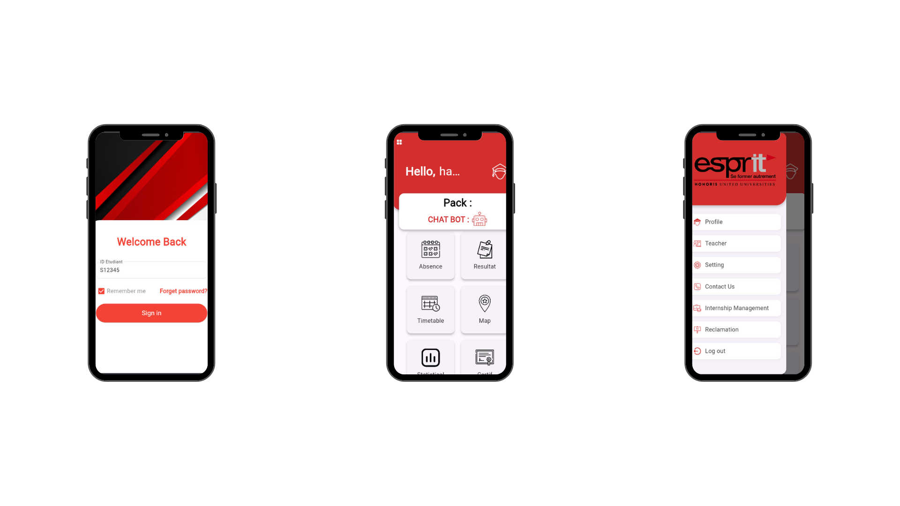
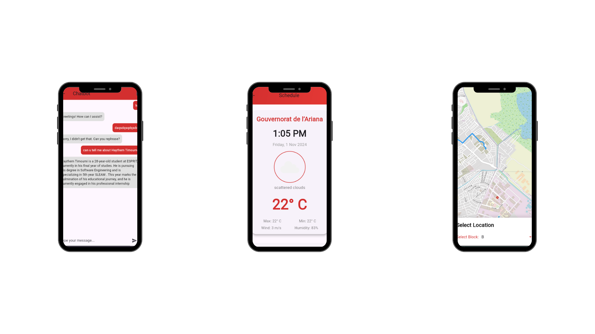
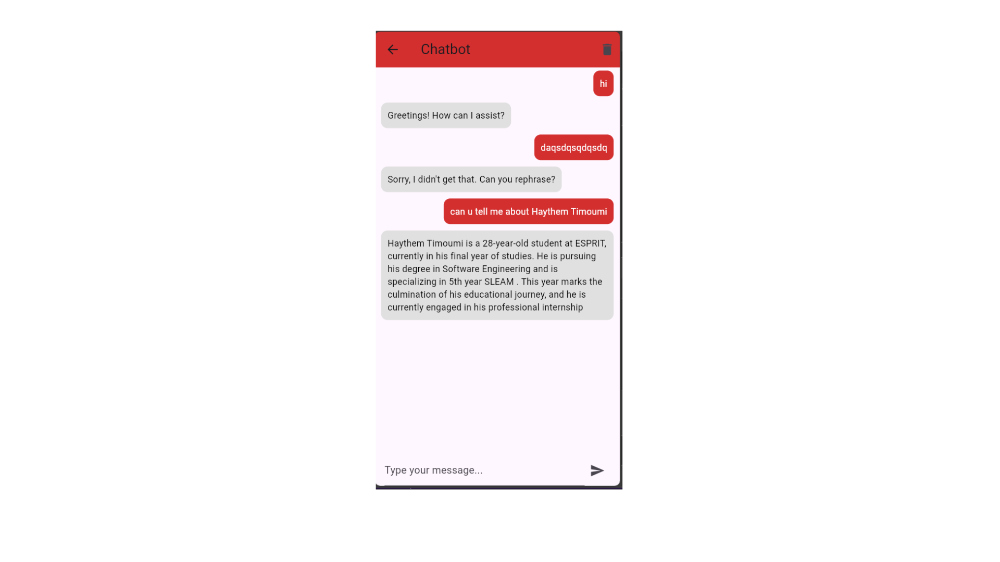
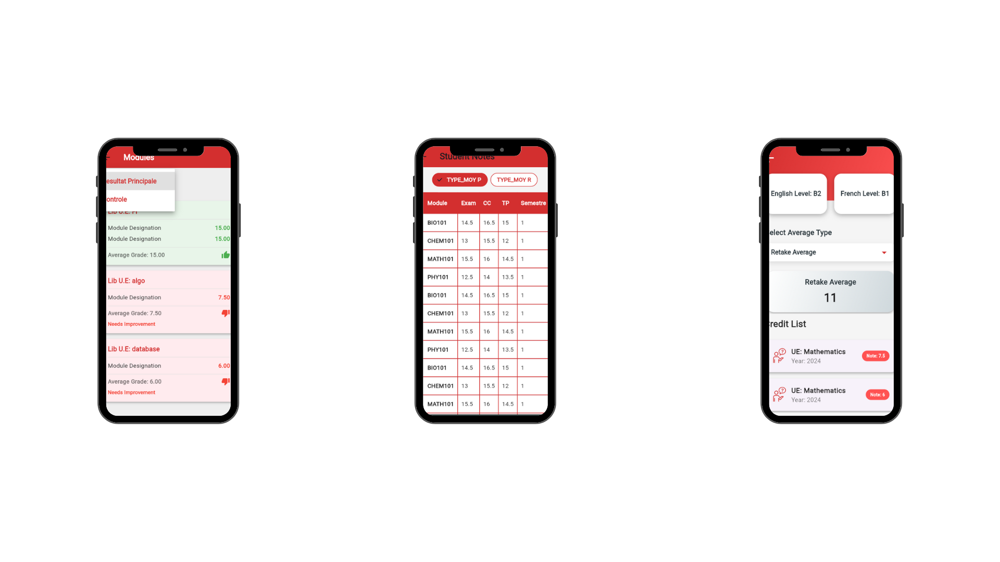
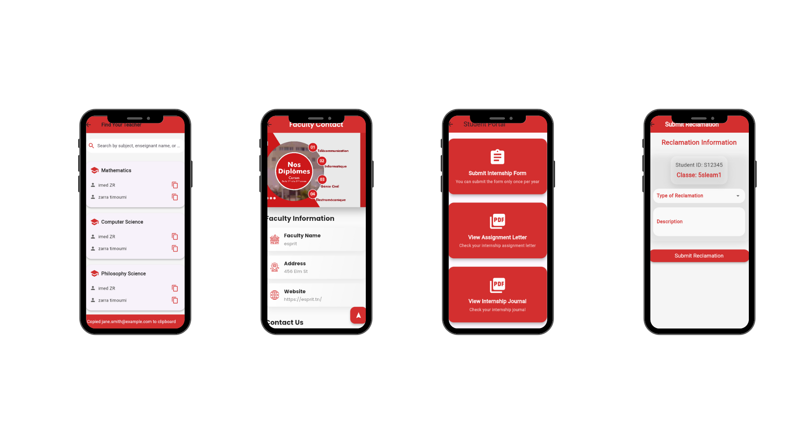
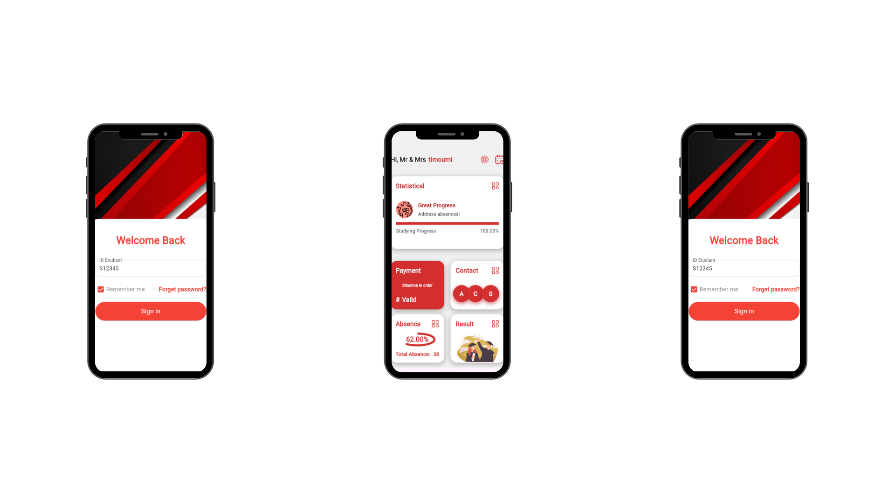

## Project Overview

This Flutter application is designed with two distinct dashboards to cater to two different user roles: **Students** and **Parents**. Each dashboard is tailored to provide a unique and interactive experience while serving the specific needs of the users.

---

## Key Features

### Student Dashboard
- 
- **Interactive Free Resource Map**: Students can explore educational resources through an interactive map.
-  
- **Chatbot**: A friendly chatbot is integrated to assist students with queries and provide guidance.
- 
- **Access to Grades**: Students can view their academic results and performance.
- 
- **Teacher Details**: Students can access teacher contact information such as email addresses.
- 

### Parent Dashboard

- **Child Absence Tracking**: Parents can monitor their child’s attendance records.
- **Grade Viewing**: Parents can see their child’s academic results.

---

## Data Visualization

The app includes various types of charts to represent data effectively:
- **Line Charts**
- **Bar Charts**
- **Pie Charts**
- **Scatter Charts**

---

## Installation

Follow these steps to set up and run the application:

1. Clone the repository:
   ```bash
   git clone https://github.com/yourusername/your-repo.git
   ```

2. Navigate to the project directory:
   ```bash
   cd your-repo
   ```

3. Install dependencies:
   ```bash
   flutter pub get
   ```

4. Run the application:
   ```bash
   flutter run
   ```

---

## Requirements

- **Flutter SDK**: Version 3.x or later
- **Dart SDK**: Version 2.x or later
- **Supported platforms**: Android and iOS

---

## App Structure

- `lib/`: Contains the main Flutter application code.
- `screens/`: Holds the different screens for the student and parent dashboards.
- `widgets/`: Reusable UI components.
- `models/`: Data models used in the app.
- `services/`: Handles API calls and backend integration.

---

## Contributing

We welcome contributions to enhance the application. To contribute:

1. Fork the repository.
2. Create a new branch for your feature:
   ```bash
   git checkout -b feature-name
   ```
3. Commit your changes:
   ```bash
   git commit -m "Add new feature"
   ```
4. Push your branch:
   ```bash
   git push origin feature-name
   ```
5. Create a pull request on GitHub.

---

## License

This project is licensed under the MIT License. See the [LICENSE](LICENSE) file for details.

---

Thank you for using and contributing to our app! Feel free to reach out if you have any questions or suggestions.
